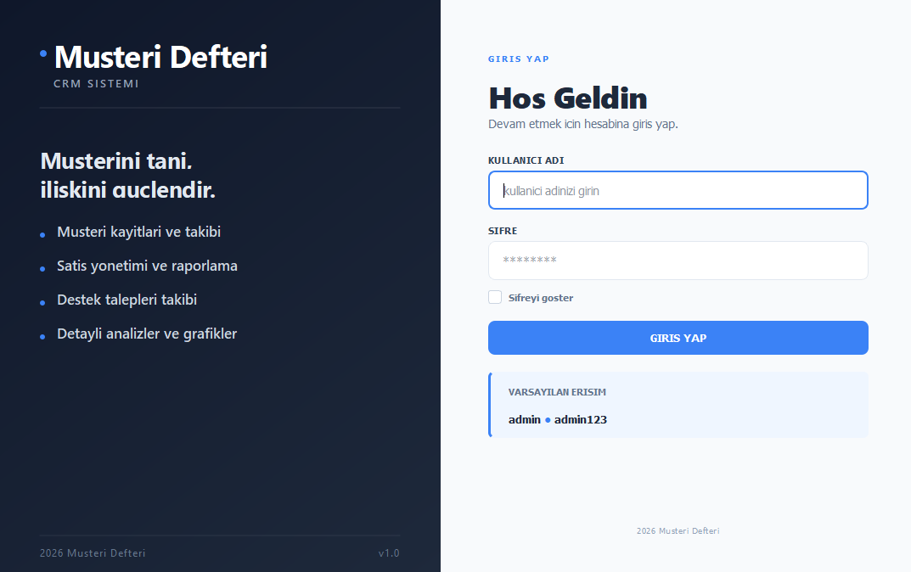
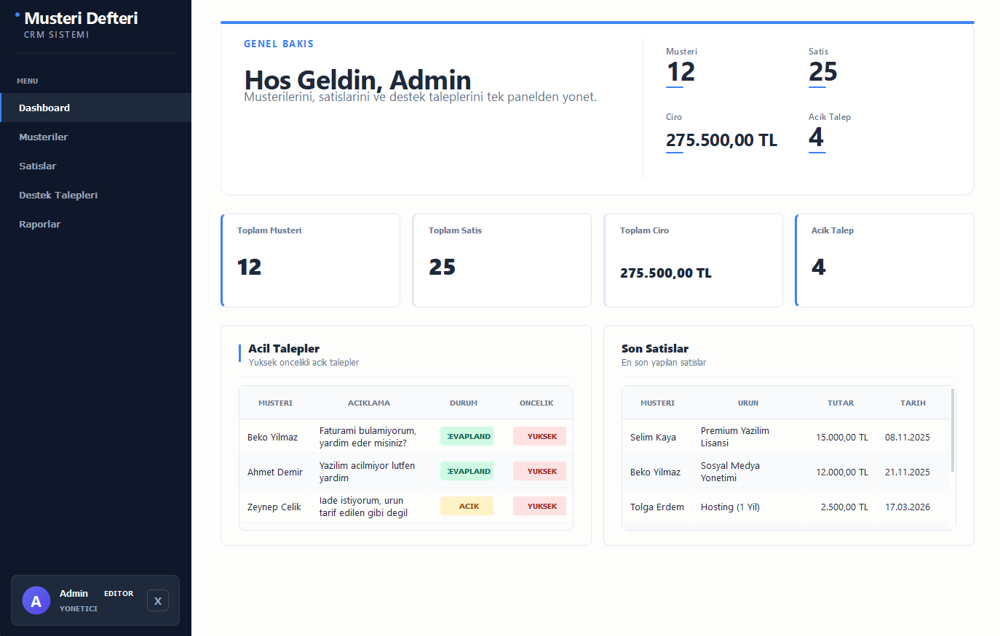
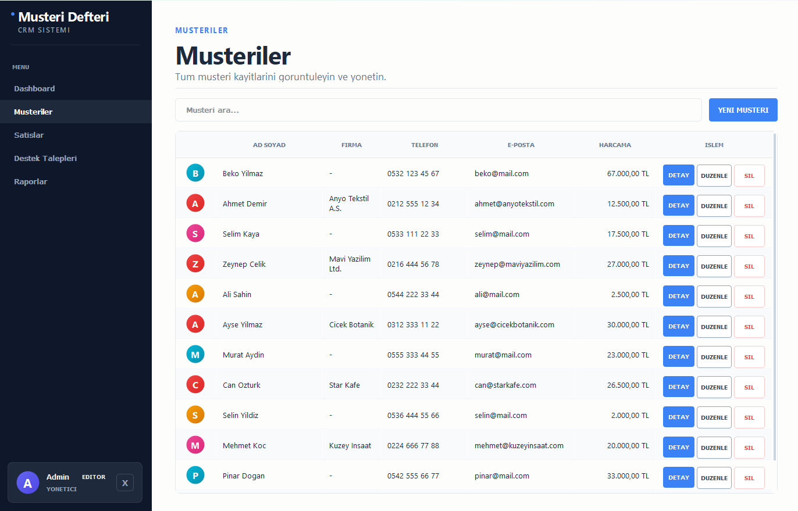
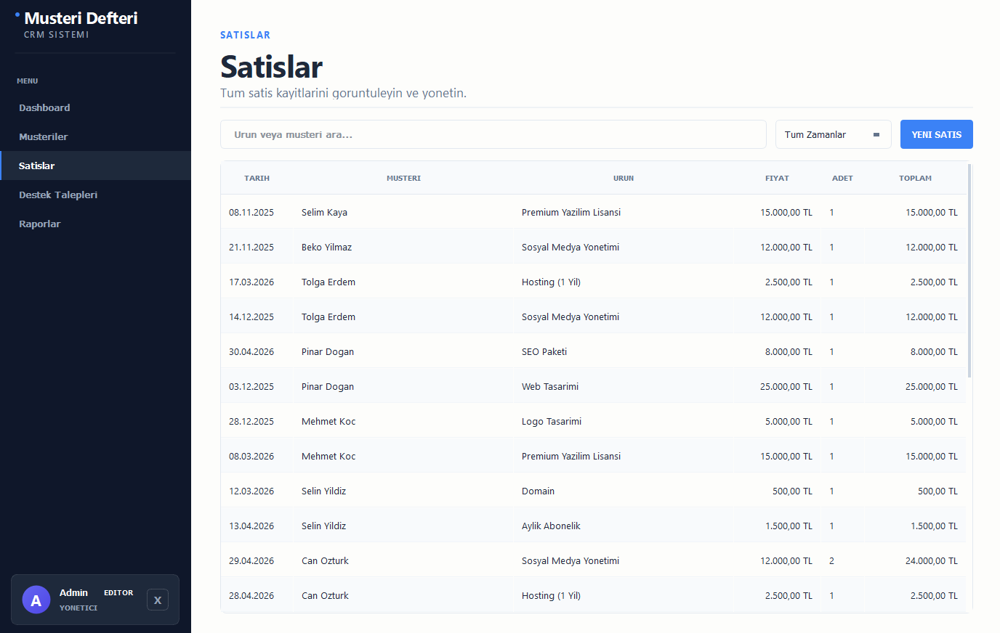
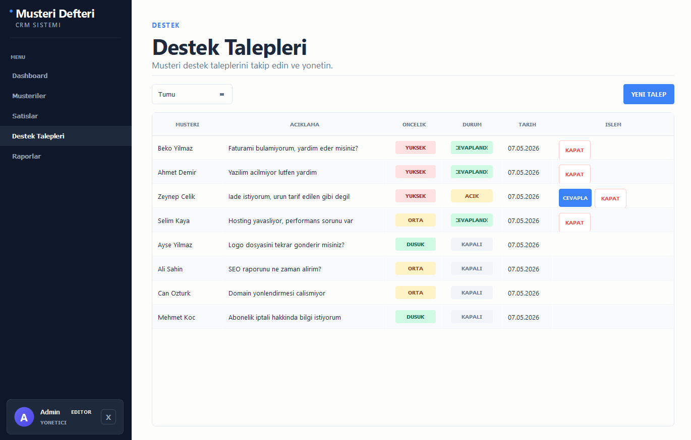
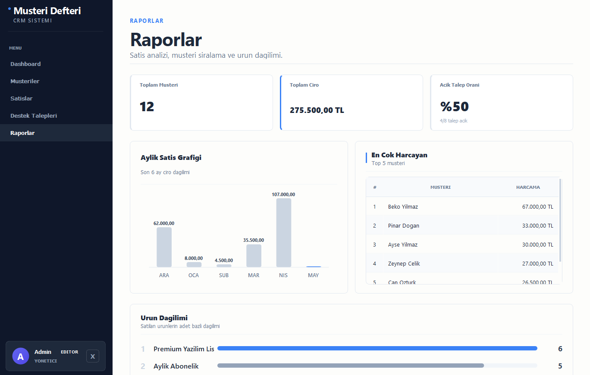

# Musteri Defteri - Basit CRM Sistemi

Musteri kayitlari, satis islemleri ve destek taleplerinin yonetildigi masaustu uygulamasidir. PyQt5 ile koyu temali, mavi accentli kurumsal bir arayuz sunar.

## Teknolojiler

- **Python 3** - Programlama dili
- **PyQt5 (>=5.15.0)** - Masaustu GUI framework
- **JSON** - Veri kaliciligi
- **PBKDF2-HMAC-SHA256** - Sifre guvenligi

## Proje Yapisi

    Basit CRM Sistemi/
    ├── main.py                          # Ana giris noktasi
    ├── requirements.txt                 # Bagimliliklar
    ├── backend/
    │   ├── veri_yoneticisi.py          # CRUD islemleri ve istatistikler
    │   ├── musteri.py                  # Musteri modeli
    │   ├── satis.py                    # Satis modeli
    │   ├── destek_talebi.py            # Destek talebi modeli
    │   ├── auth.py                     # Kimlik dogrulama
    │   └── seed.py                     # Ornek veri yukleme
    ├── frontend/
    │   ├── ana_pencere.py              # Ana pencere
    │   ├── login.py                    # Giris ekrani
    │   ├── tema.py                     # Koyu tema
    │   ├── views/
    │   │   ├── dashboard.py            # Kontrol paneli
    │   │   ├── musteriler.py           # Musteri yonetimi
    │   │   ├── satislar.py             # Satis islemleri
    │   │   ├── destek_talepleri.py     # Destek talepleri
    │   │   └── raporlar.py             # Istatistikler ve raporlar
    │   └── widgets/
    │       ├── bilesenler.py           # UI bilesenleri
    │       └── diyaloglar.py           # Modal diyaloglar
    ├── images/                          # Ekran goruntuleri
    └── data/
        ├── musteriler.json
        ├── satislar.json
        ├── talepler.json
        └── kullanicilar.json

## Ana Siniflar

### Musteri (`backend/musteri.py`)

- **Ozellikler:** `musteri_id`, `ad`, `telefon` (otomatik temizlenir), `email`, `firma`, `kayit_tarihi`
- **Metodlar:** Toplam harcama hesaplama, acik talep listeleme

### Satis (`backend/satis.py`)

- **Ozellikler:** `satis_id`, `musteri_id`, `urun`, `fiyat`, `adet`, `tarih`
- **Metodlar:** Toplam tutar hesaplama (fiyat x adet)

### DestekTalebi (`backend/destek_talebi.py`)

- **Ozellikler:** `talep_id`, `musteri_id`, `aciklama`, `durum` (acik/cevaplandi/kapali), `oncelik` (yuksek/orta/dusuk), `olusturma_tarihi`, `kapanis_tarihi`
- **Metodlar:** Talep cevaplama, kapatma, acik durum kontrolu

## Ozellikler

- **Dashboard:** 4 metrik (Toplam Musteri, Toplam Satis, Acik Talep, Toplam Gelir) + son satislar tablosu + oncelik rozetleri (yuksek/orta/dusuk)
- **Musteri Yonetimi:** Ekleme, guncelleme, silme, arama, firma/bireysel filtreleme
- **Satis Islemleri:** Yeni satis kaydi, musteri secimi, urun bilgisi, adet ve fiyat, otomatik toplam hesaplama
- **Destek Talepleri:** Talep olusturma, oncelik atama, cevaplama, kapatma, durum bazli filtreleme + durum rozetleri (acik/cevaplandi/kapali)
- **Raporlar:** En cok harcayan musteriler top 5, urun bazli satis dagilimi, acik/kapali talep oranlari, CSV export
- **Tasarim:** Koyu tema (lacivert arkaplan) + mavi accent + kurumsal tipografi

## Ekran Goruntuleri

### Giris Ekrani

### Dashboard

### Musteriler

### Satislar

### Destek Talepleri

### Raporlar

## Kurulum ve Calistirma

    pip install -r requirements.txt
    python main.py

## Varsayilan Giris

- **Kullanici adi:** `admin`
- **Sifre:** `admin123`

## Ornek Veri

Ilk calistirmada 12 musteri, 25 satis ve 8 destek talebi otomatik olusturulur.
